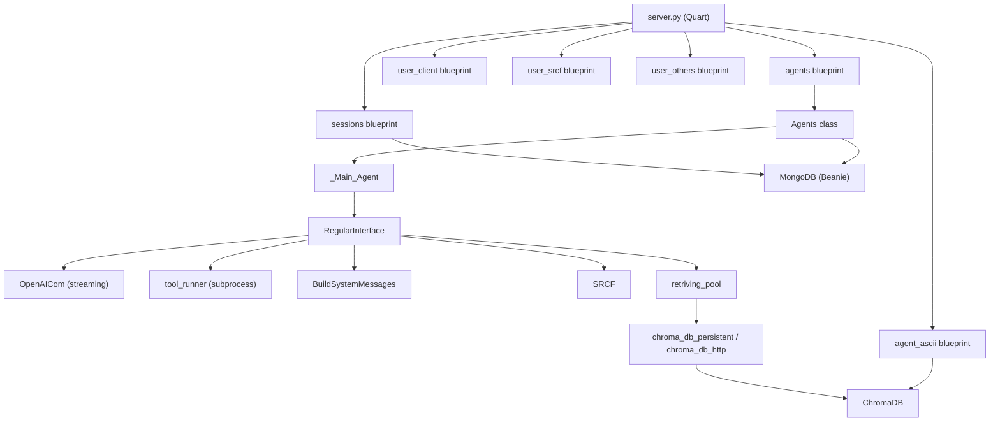

# Architecture

A detailed look at how TARS is structured, how data flows from a user message to an agent response, and how each component connects to the others.

---

## System Layers

TARS is organized into five distinct layers, each with a clear responsibility boundary:

```
┌──────────────────────────────────────────────────────┐
│  Layer 1: HTTP Interface (Quart Blueprints)          │
│  Routes, auth, request validation, SSE streaming     │
├──────────────────────────────────────────────────────┤
│  Layer 2: Application Logic                          │
│  Agent lifecycle, session CRUD, settings mutation     │
├──────────────────────────────────────────────────────┤
│  Layer 3: Agent Core (fluid framework)               │
│  Agent loop, tool dispatch, SRCF, system messages     │
├──────────────────────────────────────────────────────┤
│  Layer 4: Infrastructure                             │
│  OpenAI streaming, subprocess execution, vector DB    │
├──────────────────────────────────────────────────────┤
│  Layer 5: Storage                                    │
│  MongoDB (sessions), ChromaDB (vectors), filesystem   │
└──────────────────────────────────────────────────────┘
```

---

## Request Lifecycle: User Message → Agent Response

Here's the complete journey of a user message through the system:

### 1. HTTP Request Arrives

A client sends a `POST /api/agents/create_agent` with a session ID and conversation messages. The Quart blueprint validates the `sec_key` cookie and input types.

### 2. Agent Creation

The `Agents` class (in `agent_backend/agents/agents.py`) instantiates `_Main_Agent`:

```python
_new_agent = _Main_Agent(messages=messages, meta={"session_id": session_id})
```

This triggers:
- Loading `user.json` for LLM configuration
- **SRCF activation** — if the message count exceeds `srcf_on_length`, the conversation is semantically filtered to keep only relevant history
- **RegularInterface initialization** — the core agent object from the fluid framework

### 3. RegularInterface Initialization

Inside `RegularInterface.__init__()`, several things happen in sequence:

```
messages → skill filtering → RAG retrieval → tool filtering → system message building → SRCF → final message assembly
```

1. **Skill Filtering**: Skills are split into `default_skills` (always active) and `non_default_skills` (available but inactive)
2. **RAG Retrieval**: For each default skill's collections, the last user message is used as a query against ChromaDB. This runs in parallel via `retriving_pool()` using multiprocessing
3. **Tool Filtering**: Tools are matched to their skills. Default-skill tools are active; others are off
4. **System Message Building**: `BuildSystemMessages` constructs context-rich system prompts containing RAG results and available-but-inactive skill descriptions
5. **SRCF**: If enabled, `_group_into_turns() → trim_messages() → semantic retrieval` prunes old conversation turns
6. **Message Assembly**: System messages + SRCF-filtered history + recent messages form the final `agent_messages`

### 4. Agent Firing

`POST /api/agents/fire_agent` launches the agent loop as a non-blocking `asyncio.ensure_future()`. The agent runs on a dedicated background thread:

```python
# _Main_Agent.events() bridges sync agent → async server
thread_queue = sync_queue.Queue()
# blocking agent loop runs in thread
for event in self.ri.run_agent(...):
    thread_queue.put(event)
# async consumer yields events to the server
while True:
    item = await loop.run_in_executor(None, thread_queue.get)
    yield item
```

### 5. The Agent Loop (`run_agent`)

The core loop runs up to `max_turns` iterations:

```
for turn in 1..max_turns:
    1. Stream LLM completion
    2. Accumulate content/reasoning/tool_call tokens
    3. Check finish_reason:
       - "stop"       → yield "done", exit
       - "length"     → append partial, continue
       - "tool_calls" → execute tools, append results, continue
```

Each iteration yields structured events:

| Event Type | When |
|---|---|
| `content` | Each text token from the LLM |
| `reasoning` | Each reasoning/thinking token |
| `tool_start` | Tool execution begins |
| `tool_update` | Live stdout/stderr from running tool |
| `tool_timeout` | Tool exceeded its timeout window |
| `timeout_decision` | Agent decided to extend or terminate |
| `tool_done` | Tool finished |
| `tool_error` | Tool had malformed arguments |
| `error` | LLM stream errored |
| `done` | Agent loop completed |

### 6. Tool Execution

Tools are dispatched in two ways:

**Inline tools** (`add_new_skill`, `remove_skill`, `switch_skill`, `tool_run_tool`):
- Execute directly as method calls on `RegularInterface`
- No subprocess, no timeout logic
- Used for dynamic skill manipulation and timeout decisions

**External tools** (everything registered with `@tool`):
- Run in isolated **child processes** via `multiprocessing.Process`
- The tool function is imported and called in a fresh Python subprocess
- Live stdout/stderr is pumped via background threads and forwarded through `update_q`
- Timeout management: when the deadline expires, the agent gets a side-channel LLM call to decide: extend the timeout or kill the process

### 7. Event Broadcasting (SSE)

The `SessionBroadcaster` implements a pub/sub pattern:

```python
class SessionBroadcaster:
    # Each listener gets its own asyncio.Queue
    # publish() fans events to ALL subscribers
    # No event stealing between connections
```

`GET /api/agents/stream_agent_events?session_id=X` opens an SSE connection. The server yields `data: {...}\n\n` lines until the agent sends a `None` sentinel.

### 8. Persistence

After each event, the `Agents._event_viewer()` method:
1. Buffers `content` and `reasoning` tokens
2. On any non-streaming event (tool_start, tool_done, done, etc.), flushes the buffers as new messages in MongoDB
3. Saves the raw event object for UI replay

---

## Component Dependency Graph



---

## Threading & Process Model

TARS uses a careful multi-threading and multi-processing strategy:

### Main Process (Quart event loop)
- Handles all HTTP requests
- Runs the async event loop
- Never blocks on I/O

### Agent Thread (per session)
- One dedicated `threading.Thread` per active agent
- Runs the synchronous `run_agent()` loop
- Communicates with the async world via `queue.Queue`

### Tool Processes (per tool call)
- Each external tool call spawns a `multiprocessing.Process`
- The tool code runs in complete isolation
- Communication via `multiprocessing.Manager().Queue()`
- Three queues per tool: `in_q` (decisions in), `out_q` (decisions out), `update_q` (live updates)

### RAG Worker Pool
- `retriving_pool()` uses `multiprocessing.Pool` with `spawn` context
- Each retrieval task runs in its own worker process
- Embedding functions are cached per-worker to avoid reloading models

```
Main Process (Quart async)
│
├── Agent Thread (session A) ─── Tool Process (download_file)
│                             └── Tool Process (run_shell_command)
│
├── Agent Thread (session B) ─── Tool Process (...)
│
└── RAG Pool (spawned workers)
    ├── Worker 1 (query collection "base")
    ├── Worker 2 (query collection "OS")
    └── Worker N (...)
```

---

## Security Model

Authentication is cookie-based using a shared secret key:

1. The secret key is stored in `user.json` under `sec_key`
2. Every API request must include a `sec_key` cookie
3. `validate_sec_key()` checks the cookie value against the stored key
4. The key can be changed via `python3 -m set_secret_key NEW_KEY`

> **Note:** This is a single-user system designed for local/self-hosted use. The security model is intentionally simple — there is no multi-user auth, no token rotation, and no rate limiting.

---

## Data Flow: File Ingestion (ASCII/RAG)

When a user uploads a text file for RAG:

```
User uploads .txt/.md file
        │
        ▼
POST /api/agent/ascii/dump_new
        │
        ▼
make_file_chunks()          ← Word-safe chunking with overlap
        │
        ▼
dump_in()                   ← Embed chunks + store in ChromaDB
        │                     (collection: "base", metadata: {session_id: ...})
        ▼
add_new_path()              ← Record file metadata in MongoDB session
```

At query time, the agent's default skill retrieves relevant chunks:

```
User message
    │
    ▼
retriving_pool()            ← Parallel vector search across all collections
    │
    ▼
BuildSystemMessages()       ← Format retrieved contexts into system prompt
    │
    ▼
LLM sees relevant knowledge as part of its context
```
