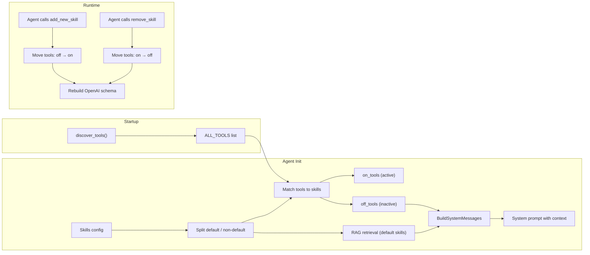

# Skills & RAG

How TARS organizes tools into skills, how the agent dynamically manages its own capabilities, and how vector-based knowledge retrieval (RAG) integrates with the skill system.

---

## What Is a Skill?

A **skill** is a named group of related tools and an optional set of **RAG collections** (vector databases for knowledge retrieval). Skills are the primary organizational unit for agent capabilities.

```
Skill: "OS"
├── Tools: download_file, run_shell_command, write_text_file, ...
└── Collections:
    ├── "base"  → user-uploaded file chunks (per-session)
    └── "OS"    → OS-specific knowledge base
```

---

## Default vs Non-Default Skills

| Property | Default Skill | Non-Default Skill |
|---|---|---|
| **Active at start** | Yes — tools are available immediately | No — agent must explicitly activate it |
| **RAG retrieval** | Runs automatically on every agent invocation | Not queried until activated |
| **Removable** | No — cannot be removed by the agent | Yes — agent can add/remove/swap at will |
| **Context injection** | RAG results injected into system prompt | Tool list shown in "available but inactive" section |

### Current Skill Configuration

TARS ships with one default skill:

```python
# agent/system/configurations/configs/skills.py

{
    "name": "OS",
    "default": True,
    "template": "This is your OS skill. Use these tools...\n{placeholder}",
    "collections": [
        {
            "name": "base",              # User-uploaded document chunks
            "max_result": 3,
            "threshold": 2.0,
            "meta": {"session_id": "..."}, # Scoped to the current session
            "collec_template": "RELEVANT KNOWLEDGE FROM USER:\n{placeholder}",
            "em_setup": { ... }
        },
        {
            "name": "OS",                # OS skill knowledge base
            "max_result": 3,
            "threshold": 2.0,
            "collec_template": "RELEVANT KNOWLEDGE FROM SKILL:\n{placeholder}",
            "em_setup": { ... }
        }
    ],
    "backend": {
        "persistent_backend": {
            "path": "TARS_DB"
        }
    }
}
```

---

## How Skills Are Processed at Agent Initialization

When `RegularInterface` is initialized, skills go through a multi-step pipeline:

### Step 1: Skill Separation

```python
_filter_default_and_non_default_skills(skills)
# Returns: (default_skills, non_default_skills)
```

Skills with `"default": True` go to the default bucket. Everything else goes to non-default.

### Step 2: Tool Assignment

```python
filter_tools_by_default_skills(default_skills, non_default_skills, all_tools)
# Returns: (on_tools, off_tools)
```

- **`on_tools`**: Tools whose `skill` matches any default skill → immediately available to the LLM
- **`off_tools`**: Tools whose `skill` matches a non-default skill → stored but not exposed

### Step 3: RAG Retrieval (Default Skills Only)

For each default skill's collections, the last user message is queried against ChromaDB:

```python
retriving_pool(
    query="the user's last message",
    locations=default_skills,
)
```

This returns relevant document chunks that are injected into the system prompt.

### Step 4: System Message Construction

`BuildSystemMessages` produces two strings:

1. **Non-default skills summary**: Lists each inactive skill with its tools (name, description, typical execution time), so the agent knows what it *could* activate
2. **Default skills + RAG context**: Injects retrieved documents under each default skill's template

---

## Dynamic Skill Management

The agent has three built-in tools for managing its own skills at runtime:

### `add_new_skill(skill_name)`

Activates a non-default skill. This:
1. Moves the skill from `non_default_skills` → tracked as newly added
2. Moves all its tools from `off_tools` → `on_tools`
3. Rebuilds the OpenAI tool schema so the LLM sees the new tools on the next turn

**Constraints:**
- Cannot add a skill that's already default
- Cannot add a skill that's already active
- Cannot exceed `MAX_NEW_SKILLS` limit (from `.env`)
- Skill must exist in the catalog

### `remove_skill(skill_name)`

Deactivates a previously-added skill:
1. Removes the skill from the active set
2. Moves its tools back to `off_tools`
3. Rebuilds the OpenAI tool schema

**Constraints:**
- Cannot remove a default skill
- Skill must be currently active

### `switch_skill(skill_name, to_which)`

Atomic swap — removes one skill and adds another in a single operation. Equivalent to `remove_skill(A)` + `add_new_skill(B)` but without an intermediate state where neither is active.

**Constraints:**
- Cannot switch a default skill
- `skill_name` must be active, `to_which` must be inactive
- Both must exist in the catalog

### How the LLM Sees Available Skills

In the system prompt, inactive skills appear like this:

```
THESE SKILLS ARE AVAILABLE, BUT NOT ACTIVE. USE SKILL MANIPULATION TO ACTIVE THEM IF NECESSARY.

    - SKILL NAME: web
        - TOOL NAME: fetch_url
        - TIME NEEDED: usually takes 10 seconds
        - DESCRIPTION: Fetch a web page and return its HTML content.

        - TOOL NAME: parse_html
        - TIME NEEDED: usually not takes time
        - DESCRIPTION: Extract text from HTML using CSS selectors.
```

This gives the agent enough information to decide whether to activate a skill.

---

## Adding a New Skill

### 1. Create Your Tools

```python
# tools/web_tools.py
from fluid.toolkit.tool_registry import tool

@tool(skill="web", usually_takes=10)
def fetch_url(url: str, timeout: int = 30) -> str:
    """Fetch a web page and return its text content."""
    import requests
    response = requests.get(url, timeout=timeout)
    return response.text[:5000]

@tool(skill="web")
def extract_links(html: str) -> str:
    """Extract all links from HTML content."""
    from html.parser import HTMLParser
    links = []
    # ... parsing logic
    return "\n".join(links)
```

### 2. Register the Skill

Add the skill definition in `agent/_agent_/skills.py`:

```python
SKILLS = [
    {
        "name": "OS",
        "default": True,
        "template": "...\n{placeholder}",
        "device": "cpu",
    },
    {
        "name": "web",
        "default": False,  # Agent must activate this explicitly
        "template": "Web browsing tools for fetching and parsing web content.\n{placeholder}",
        "device": "cpu",
    },
]
```

### 3. (Optional) Add RAG Collections

If your skill needs its own knowledge base, add collections in the skill config:

```python
# agent/system/configurations/configs/skills.py

web_skill = {
    "name": "web",
    "default": False,
    "template": "Web tools\n{placeholder}",
    "collections": [
        {
            "name": "web_knowledge",
            "max_result": 3,
            "threshold": 2.0,
            "collec_template": "WEB KNOWLEDGE:\n{placeholder}",
            "em_setup": {
                "openai_embed": {
                    "base_url": "...",
                    "api_key": "...",
                    "model": "...",
                }
            },
        }
    ],
    "backend": {
        "persistent_backend": {"path": "TARS_DB"}
    },
}
```

---

## RAG (Retrieval-Augmented Generation)

### Overview

RAG gives the agent access to external knowledge by querying vector databases for content relevant to the user's message. Retrieved chunks are injected into the system prompt so the LLM can reference them.

### How RAG Works in TARS

```
User message: "How do I configure nginx?"
        │
        ▼
retriving_pool()
        │
        ├── Query "base" collection (user-uploaded files for this session)
        │   └── metadata filter: {"session_id": "current_session"}
        │
        └── Query "OS" collection (OS skill knowledge)
            └── no metadata filter
        │
        ▼
Results filtered by distance threshold (2.0)
        │
        ▼
BuildSystemMessages formats results:

    SKILL NAME: OS
        RELEVANT KNOWLEDGE FROM USER:
            - [chunk about nginx config from uploaded file]
            - [another relevant chunk]

        RELEVANT KNOWLEDGE FROM SKILL:
            - [chunk from OS knowledge base]
```

### Vector Storage (ChromaDB)

TARS uses **ChromaDB** with a persistent on-disk backend at `TARS_DB/`.

#### Collections

| Collection | Purpose | Metadata |
|---|---|---|
| `base` | User-uploaded file chunks | `{"session_id": "..."}` — scoped per session |
| `OS` | OS skill knowledge base | None — shared across sessions |

#### Embedding Models

Embeddings can be generated via:

1. **OpenAI-compatible API** (configured in skill's `em_setup.openai_embed`):
   ```python
   {"base_url": "http://localhost:11434/v1", "api_key": "ollama", "model": "bge-large-en-v1.5"}
   ```

2. **Local HuggingFace models** (configured in `em_setup.local_em`):
   ```python
   {"model": "/path/to/sentence-transformer-model"}
   ```

### File Ingestion Pipeline

When a file is uploaded via the ASCII API:

```
Text content
    │
    ▼
make_file_chunks()
    │  - Splits text into word-safe chunks
    │  - Each chunk is cha_per_chunk characters with overlap
    │  - Generates unique IDs per chunk
    │
    ▼
dump_in()
    │  - Creates OpenAI embedding function
    │  - Adds documents + IDs + metadata to ChromaDB
    │
    ▼
add_new_path()
       - Records file metadata in the MongoDB session
       - Stores: file_name, file_size, chunk_count, timestamp
```

#### Chunking Algorithm

The `make_file_chunks()` function in `utils.py`:

1. Splits text into individual words
2. Builds chunks of approximately `cha_per_chunk` characters
3. Each chunk overlaps the previous by `overlap` characters (word-safe boundaries)
4. Each chunk gets a unique ID: `{collection_name}_{file_name}_{uuid}`

Example with `cha_per_chunk=100, overlap=30`:

```
Chunk 1: "The quick brown fox jumps over the lazy dog. Lorem ipsum dolor sit amet..."
                                                              ↑ overlap starts here
Chunk 2: "dolor sit amet, consectetur adipiscing elit. Sed do eiusmod tempor..."
```

### Retrieval at Query Time

The `retriving_pool()` function handles parallel retrieval:

1. **Build tasks**: For each skill's collections, create a retrieval task
2. **Spawn workers**: Use `multiprocessing.Pool` (spawn context) to run queries in parallel
3. **Per-worker caching**: Each worker caches its embedding function to avoid reloading models
4. **Distance filtering**: Results above the threshold are discarded
5. **Result grouping**: Flat results are nested by skill → collection

#### Why Multiprocessing?

Two critical reasons:

1. **GIL avoidance**: Embedding models (sentence-transformers, torch) are CPU-intensive. Running them in separate processes bypasses Python's GIL.
2. **Deadlock prevention**: `fork()`-ing a process that has loaded `torch` or `transformers` can hang due to inherited locks. TARS explicitly uses `spawn` context:
   ```python
   mp_ctx = multiprocessing.get_context("spawn")
   ```
   It also sets `TOKENIZERS_PARALLELISM=false` to prevent HuggingFace tokenizer thread deadlocks.

### Clearing Vectors

Vectors can be cleared at different scopes:

| Scope | Method | When |
|---|---|---|
| **Per session** | `DELETE /api/agent/ascii/clear_session_vectors` | User removes uploaded files |
| **Per session** | Automatic on `DELETE /api/sessions/delete_session` | Session deletion |
| **All vectors** | Automatic on `POST /api/user/client/update_em_model` | Embedding model change (old vectors incompatible) |

---

## SRCF & Skills Interaction

SRCF (Self-Referential Context Filtering) operates **after** skill initialization but **before** the final message assembly:

```
1. Skills separated (default / non-default)
2. RAG retrieval runs for default skills
3. Tools assigned to skills
4. System messages built (with RAG context)
5. ← SRCF runs here: filters old messages ─┐
6. Final messages assembled:                │
   [system messages] +                     │
   [SRCF-filtered old messages] +          │
   [recent messages]                       ▼
```

SRCF does **not** filter system messages or RAG context — it only trims the conversation history. This means RAG-retrieved knowledge is always present in full, even when old messages are pruned.

---

## Skill System Architecture Diagram


